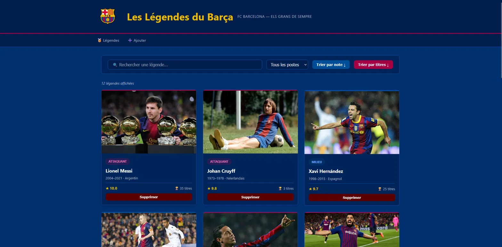
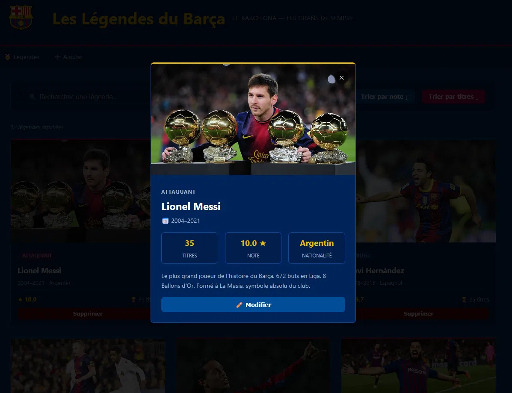
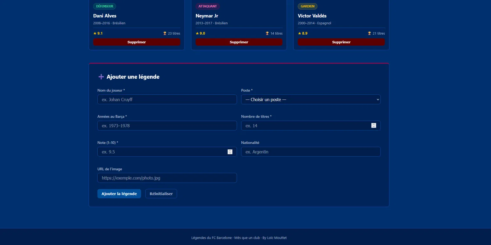
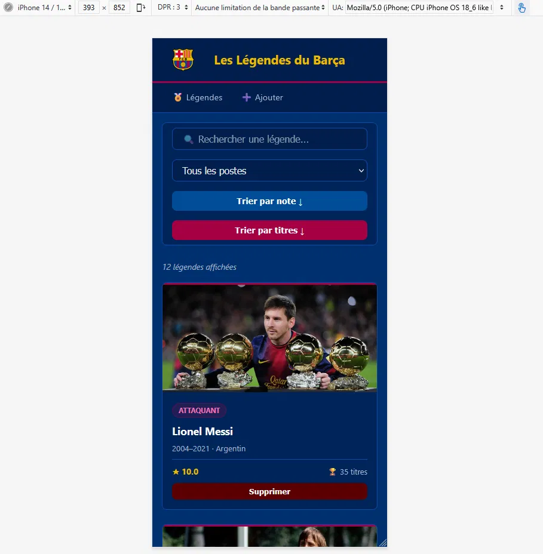
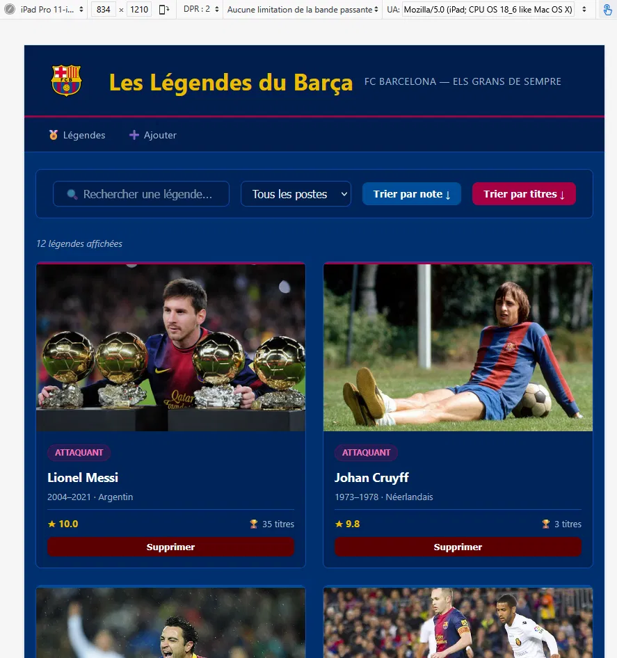

# Légendes du FC Barcelone

Projet JavaScript — Cours C122 (ESIG)

## Description

Application web pour gérer une collection des plus grandes légendes du FC Barcelone.
J'ai choisi cette ressource, car je suis passionné de football et fan du Barça depuis
toujours. Le projet permet de consulter, trier, rechercher et gérer les légendes du
club avec leurs statistiques (note, titres, poste, nationalité, années au club).

## Lien GitHub Pages

https://loicmouttet.github.io/122-projet-personnel-loic-mouttet/

## Fonctionnalités

- [x] Affichage dynamique de la liste (cartes avec image, nom, poste, note, titres)
- [x] Tri par note et par nombre de titres (ASC / DESC)
- [x] Recherche en temps réel par nom de joueur
- [x] Filtrage par poste (Gardien, Défenseur, Milieu, Attaquant)
- [x] Ajout d'une légende via formulaire avec validation
- [x] Suppression avec confirmation
- [x] Modification d'une légende existante
- [x] Modal de détail au clic sur une carte
- [x] Responsive (mobile, tablette, desktop)

## Captures d'écran

## Transparence IA
- Je dirais que j'ai beaucoup utilisé l'IA, car j'ai été aidé par l'auto-complétion et les suggestions de code de Copilot.
- Deuxièmement, j'ai utilisé Claude afin de vérifier si j'allais dans la bonne direction et si je respectais les exigences de la consigne.

### Outils utilisés

- Copilot (GitHub) pour la génération de code JavaScript et la structuration du projet.
- Claude (Anthropic) pour la génération du code HTML, CSS et JavaScript.

### Prompts utilisés

- Sur la base de mon code HTML, CSS et JavaScript et de la consigne, peux-tu me donner
  le code pour déjà faire une base d'un site web sur les légendes du FC Barcelone que je pourrais ensuite modifier et améliorer à ma guise ?
- Simplifie le CSS pour améliorer la compréhension, respecte cette palette de couleurs, ne mets pas trop de commentaires inutiles.
- Peux-tu ajouter une option qui permettrait d'insérer une image au joueur dans la fonctionnalité d'ajout de joueur ?
- Peux-tu m'expliquer comment fonctionne cette fonctionnalité ?

### Ce que j'ai appris vs ce que l'IA a généré

- **Écrit et ajusté par moi** : Les données des joueurs à quelques exceptions près, le choix des images, les couleurs de la palette Barça, le réglage du cadrage des photos.
  (`imgPosition`), le logo, le titre et le contenu du footer.
- **Appris grâce à l'IA** : j'ai compris comment fonctionne la délégation d'événements
  avec `.closest()`, le pattern `data.map()` pour modifier un objet dans un tableau,
  la différence entre `object-fit` et `object-position`, et pourquoi les `?` en début
  de ligne causent des erreurs JSHint (W014)